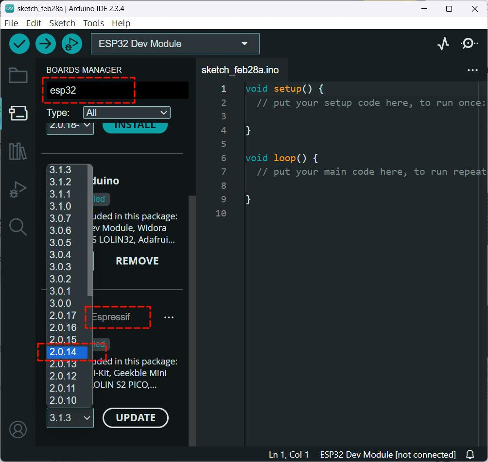

# TTGO T-Watch Library

<<<<<<< Updated upstream
LilyGO T-Watch library for ESP32-based smartwatch with LVGL UI, sensors, and embedded firmware.

## Overview

This library provides comprehensive support for the LilyGO T-Watch 2019/2020 series smartwatches. It includes:

- **LVGL-based UI** with headless rendering support for testing
- **Step Counter** with daily goals and progress tracking
- **Battery Monitor** with voltage monitoring, charging detection, and power saving modes
- **State Machine** for managing watch states (IDLE, RECORDING, STREAMING, ERROR, DEEP_SLEEP)
- **BLE Audio** streaming support with GATT server lifecycle management
- **Sensor Integration** including BMA423 accelerometer

## Project Structure

```
TTGO_TWatch/
├── src/                    # Main library source files
│   ├── TTGO.h            # Main TTGO class header
│   ├── StepCounter.h     # Step counting functionality
│   ├── BatteryMonitor.h  # Battery monitoring
│   ├── StateMachine.h    # State machine management
│   └── lvgl/             # LVGL graphics library (v7.x)
├── test/                   # Test suites
│   ├── test_native/      # Native unit tests (no LVGL)
│   ├── test_statemachine/ # State machine tests
│   ├── test_ble_audio/   # BLE audio tests
│   ├── test_battery/     # Battery monitor tests
│   └── test_lvgl_render/ # LVGL headless rendering tests
├── docs/                   # Documentation
│   ├── power.md          # Power management guide
│   ├── pinmap.md         # Pin mapping reference
│   └── watch_2020_v3.md  # T-Watch 2020 v3 documentation
├── platformio.ini        # PlatformIO configuration
└── MARISOL.md           # Pipeline context (auto-generated)
```

## Installation

### PlatformIO Setup

This project uses PlatformIO for building and testing. Ensure you have PlatformIO installed:

```bash
pip install platformio
```

### Dependencies

The project requires the following dependencies:

- **ESP32 Arduino Framework** - Core ESP32 support
- **TFT_eSPI** - Display driver library
- **lvgl** - Light and Versatile Graphics Library (v7.x)
- **NimBLE** - BLE stack for ESP32
- **BMA423** - Accelerometer driver (from T-Watch BSP)

## Building

### ESP32 Firmware Build

Build the firmware for the ESP32 board:

```bash
pio run -e esp32
```

### Native Tests (no ESP32 needed)

Run unit tests on the host machine:

```bash
pio test -e native -v
```

### LVGL Simulator (headless rendering)

Run LVGL rendering tests with screenshot capture:

```bash
SIM_SCREENSHOT_DIR=screenshots pio test -e native_lvgl -v
```

Screenshots are saved as PPM files in the `screenshots/` directory.

## Testing

### Test Suites

The project includes 104 tests across 5 test suites:

| Suite | Directory | Tests | Description |
|-------|-----------|-------|-------------|
| Step Counter | `test/test_native/` | 14 | Init, step counting, daily goals, reset, config, LVGL ring |
| State Machine | `test/test_statemachine/` | 20 | States (IDLE/RECORDING/STREAMING/ERROR/DEEP_SLEEP), button press, BLE connect/disconnect, timeouts, watchdog, callbacks |
| BLE Audio | `test/test_ble_audio/` | 48 | UUID validation, state transitions, audio chunks, callbacks, battery level, GATT server lifecycle |
| Battery Monitor | `test/test_battery/` | 15 | Voltage, percentage, alerts (edge-triggered), charging, power saving, config, USB detection |
| LVGL Simulator | `test/test_lvgl_render/` | 7 | Headless init, label/button/bar/arc rendering, PPM export, multi-screen navigation |

### Running Tests

```bash
=======
**Embedded C library for LilyGO T-Watch with native unit tests and LVGL headless simulation**

[](https://platformio.org)
[](https://github.com/ThrowTheSwitch/Unity)
[](https://lvgl.io)
[](LICENSE)

---

## 🌟 LilyGO T-Watch

**English | [中文](docs/details_cn.md)**

<h2 align = "left">⭐ News </h2>

1. **T-Watch-S3** version is [here](https://github.com/Xinyuan-LilyGO/TTGO_TWatch_Library/tree/t-watch-s3)
2. In order to be compatible with multiple versions of T-Watch, all examples include a `config.h` file. For the first use, you need to define the **T-Watch** model you use in the `config.h` file
3. In the `config.h` file, you can also see similar definitions, such as **LILYGO_WATCH_LVGL**, **LILYGO_WATCH_HAS_MOTOR**, this type of definition, it will be responsible for opening the defined module function, all definitions Will be available here [View](./docs/defined_en.md)
4. Most of the examples are only used as hardware function demonstrations. This library only completes some initialization work and some demonstrations. For more advanced gameplay, please see [TTGO.h](https://github.com/Xinyuan-LilyGO/TTGO_TWatch_Library/blob/master/src/TTGO.h), to understand how to initialize, after being familiar with it, you can completely leave this library for more advanced gameplay
- About API, please check the source code
- Example [description](docs/examples_en.md)
- The latest factory firmware is made by [sharandac/My-TTGO-Watch](https://github.com/sharandac/My-TTGO-Watch)


- Demonstration effect of T-Watch2020-V3 from lunokjod


---

## 🚀 Features

### Hardware Support
1. The library already contains all the hardware drivers for `T-Watch`
2. Using **TFT_eSPI** as the display driver, you can directly call **TFT_eSPI** through the construction object.
3. Using **lvgl v7.7.2** as the display graphics framework, the driver method has been implemented, you only need to call lvgl api according to your own needs.
4. For the use of lvgl please refer to **[lvgl docs](https://docs.lvgl.io/master/)**

### Modular Components
- **StepCounter** — BMA423 accelerometer-based step counting with daily goals and LVGL progress rings
- **BatteryMonitor** — AXP202 battery voltage/percentage monitoring with edge-triggered alerts
- **StateMachine** — Recording/streaming state machine for BLE audio applications
- **BLEAudioStream** — BLE GATT server for audio streaming with mock support for unit tests
- **LVGL_Simulator** — Headless rendering with memory framebuffer and PPM export

### Development Tools
- **PlatformIO Native Tests** — Run unit tests on desktop without hardware
- **Unity Test Framework** — Embedded C unit testing with 104 test cases across 5 test suites
- **LVGL Headless Rendering** — PPM image export from LVGL widgets for automated testing
- **Hardware Simulation** — NATIVE_BUILD support for all modular components

---

## 📦 Installation

### Arduino IDE
- Install the [Arduino IDE](https://www.arduino.cc/en/Main/Software). Note: Later instructions may not work if you use Arduino via Flatpak.
- Download a zipfile from github using the "Download ZIP" button and install it using the IDE ("Sketch" -> "Include Library" -> "Add .ZIP Library...", OR:
- Clone this git repository into your sketchbook/libraries folder. For more info, see https://www.arduino.cc/en/Guide/Libraries

### PlatformIO
```bash
# Add to platformio.ini lib_deps
lib_deps = bodmer/TFT_eSPI@^2.5.43
```

---

## 🧪 Testing

### Native Unit Tests (Desktop)
Run PlatformIO native tests to verify modular components without hardware:

```bash
# Install PlatformIO
pip install platformio

>>>>>>> Stashed changes
# Run all native tests
pio test -e native -v

# Run LVGL rendering tests
pio test -e native_lvgl -v

# Run specific test suite
<<<<<<< Updated upstream
pio test -e native -v -t test_step_counter
```

### Test Architecture

- **NATIVE_BUILD**: Source files with `#include <Arduino.h>` are guarded with `#ifdef NATIVE_BUILD`
- **Test Isolation**: Each test suite is in its own directory to avoid PlatformIO main() linking conflicts
- **Mock Architecture**: Hardware mocks are used for ESP32-specific features in native tests
- **No Arduino Stubs**: When including only isolated modules, no arduino_stubs.h is needed

## PlatformIO Environments

| Environment | Purpose | test_build_src | Notes |
|-------------|---------|----------------|-------|
| `native` | Unit tests (no LVGL) | false | Excludes LVGL rendering tests |
| `native_lvgl` | LVGL headless rendering | true | Compiles `src/lvgl/`, requires PNG export |
| `esp32` | Firmware build | N/A | Builds for actual ESP32 hardware |

## Usage Examples

### Step Counter

```cpp
#include "StepCounter.h"

StepCounter stepCounter;

void setup() {
    stepCounter.begin();
}

void loop() {
    stepCounter.update();
    Serial.printf("Steps: %lu\n", stepCounter.getSteps());
}
```

### Battery Monitor

```cpp
#include "BatteryMonitor.h"

BatteryMonitor batteryMonitor;

void setup() {
    batteryMonitor.begin();
    batteryMonitor.setAlertThreshold(20);  // Alert when below 20%
}

void loop() {
    batteryMonitor.update();
    Serial.printf("Battery: %d%% (%.2fV)\n", 
                  batteryMonitor.getPercentage(),
                  batteryMonitor.getVoltage());
}
```

### State Machine

```cpp
#include "StateMachine.h"

StateMachine stateMachine;

void setup() {
    stateMachine.begin();
}

void loop() {
    stateMachine.update();
    
    switch (stateMachine.getState()) {
        case IDLE:
            // Handle idle state
            break;
        case RECORDING:
            // Handle recording state
            break;
        case STREAMING:
            // Handle streaming state
            break;
        case ERROR:
            // Handle error state
            break;
        case DEEP_SLEEP:
            // Handle deep sleep state
            break;
    }
}
```

### LVGL UI

```cpp
#include "TTGO.h"

TTGO ttgo;

void setup() {
    ttgo.begin();
    ttgo.initDisplay();
    
    // Create UI elements
    lv_obj_t *label = lv_label_create(lv_scr_act());
    lv_label_set_text(label, "Hello T-Watch!");
}
```

## Known Issues

1. **LVGL 7.x Compatibility**: The repo's `src/lvgl/tests/` has broken `green` member access - excluded via `build_src_filter = -<lvgl/tests/>`
2. **TFT_eSPI Dependencies**: PlatformIO `lib_deps` (TFT_eSPI) downloaded on first build - cache `~/.platformio` in CI
3. **BLE Audio Stream**: Requires NimBLE (ESP32 only) - native tests use `#ifdef NATIVE_BUILD` stubs
4. **BMA423 Driver**: ESP32 build requires BMA423.h from T-Watch BSP (not in PlatformIO registry) - CI warns, doesn't fail
5. **Test Isolation**: Each test suite MUST be in its own directory to avoid multiple-definition errors
6. **Native Build Isolation**: `test_build_src = true` compiles ALL source in `src/` - LVGL tests must use separate `native_lvgl` env

## Contributing

### Adding New Tests

1. Create a new test directory under `test/` (e.g., `test/test_new_feature/`)
2. Each test file must include its source directly: `#include "../src/NewFeature.cpp"`
3. Use Unity test framework macros: `TEST_ASSERT_EQUAL()`, `RUN_TEST()`, etc.
4. Add test to `platformio.ini` environment configuration

### Building for ESP32

1. Ensure all hardware dependencies are available (BMA423.h, etc.)
2. Use `pio run -e esp32` to build firmware
3. Flash using `pio run -e esp32 --target upload`

### Testing on Native Platform

1. Use `pio test -e native` for unit tests
2. Use `pio test -e native_lvgl` for LVGL rendering tests
3. Set `SIM_SCREENSHOT_DIR` for screenshot capture

## Documentation

- [Power Management Guide](docs/power.md)
- [Pin Map Reference](docs/pinmap.md)
- [T-Watch 2020 v3 Details](docs/watch_2020_v3.md)
- [T-Watch 2019 Details](docs/watch_2019.md)
- [Chinese Documentation](docs/details_cn.md)

## License

This project is licensed under the MIT License - see the LICENSE file for details.

## Acknowledgments

- LilyGO for the T-Watch hardware design
- LVGL for the graphics library
- PlatformIO for the development framework
- ESP32 community for the Arduino framework

## Version History

See [CHANGELOG.md](CHANGELOG.md) for detailed version history and changes.
=======
pio test -e native -t test_step_counter
```

### Test Coverage
| Component | Test File | Tests | Status |
|-----------|-----------|-------|--------|
| StepCounter | test/test_native/test_step_counter.cpp | 14 | ✅ Passing |
| BatteryMonitor | test/test_battery/test_battery_monitor.cpp | 15 | ✅ Passing |
| StateMachine | test/test_statemachine/test_statemachine.cpp | 21 | ✅ Passing |
| BLEAudioStream | test/test_ble_audio/test_ble_audio_stream.cpp | 47 | ✅ Passing |
| LVGL Renderer | test/test_lvgl_render/test_lvgl_render.cpp | 7 | ✅ Passing |
| **Total** | | **104** | **✅ All Passing** |

### Running Tests in Docker
```bash
docker run -v $(pwd):/workspace/repo lotus-platformio:latest \
  pio test -e native -e native_lvgl -v
```

---

## ⚠️ Notes

- If you don't have the `TTGO T-Watch` option in your board manager, please update the esp32 board as follows:
  - Using Arduino IDE Boards Manager (preferred)
    + [Instructions for Boards Manager](docs/arduino-ide/boards_manager.md)
  - Using Arduino IDE with the development repository
    + [Instructions for Windows](docs/arduino-ide/windows.md)
    + [Instructions for Mac](docs/arduino-ide/mac.md)
    + [Instructions for Debian/Ubuntu Linux](docs/arduino-ide/debian_ubuntu.md)
    + [Instructions for Fedora](docs/arduino-ide/fedora.md)
    + [Instructions for openSUSE](docs/arduino-ide/opensuse.md)
- Please note that this library currently only supports **esp core 3.0** and below. It is recommended to use **esp core 2.0.14**
  

---

## ❓ FAQ

- The following code is reported as an error when uploading. Please change the default upload baud rate in ArduinoIDE from '20000' to '921600'.
  ```
  A fatal error occurred: Failed to write to target RAM(result was 01070000)
  ```
- This error may also occur on MacOS if using a poorly compatible USB to serial driver. The driver at [wch.cn](https://www.wch.cn/downloads/CH34XSER_MAC_ZIP.html) is a better match. The webpage is in Chinese but the driver is digitally signed for security.

---

## 📚 How to find the sample program

* T-Watch & LilyPi
- In the Arduino board select `TTGO T-Watch`
- In the Arduino File -> Examples -> `TTGO_TWatch_Library`

---

## ⚠️ Precautions

- T-Watch-2019 & LilyPi: Since uses a special IO as the SD interface, please remove the SD card when downloading the program.

---

## 📖 Resources

- [LilyPi Pin mapping and other instructions](docs/lilypi_pinmap.md)
- [TWATCH 2019 Series pin mapping and other instructions](docs/watch_2019.md)
- [TWATCH 2020 V1 Pin mapping and other instructions](docs/watch_2020_v1.md)
- [TWATCH 2020 V2 Pin mapping and other instructions](docs/watch_2020_v2.md)
- [TWATCH 2020 V3 Pin mapping and other instructions](docs/watch_2020_v3.md)

---

## 🔄 Version Comparison

| Product | T-Watch-2019 | T-Watch-2020-V1 | T-Watch-2020-V2 | T-Watch-2020-V3 | T-Block/T-Block-V1 | LilyPi |
|---------|--------------|-----------------|-----------------|-----------------|-------------------|--------|
| **Core** | ESP32-D0WDQ6 | ESP32-D0WDQ6 | ESP32-D0WDQ6 | ESP32-D0WDQ6 | ESP32-D0WDQ6 | ESP32-WROVER-B |
| **PSRAM** | 16MBytes | 16MBytes | 16MBytes | 16MBytes | 16MBytes | 16MBytes |
| **Flash** | 8MBytes | 8MBytes | 4MBytes | 8MBytes | 8MBytes | 8MBytes |
| **PMU** | AXP202 | AXP202 | AXP202 | AXP202 | AXP202 | ❌ |
| **IMU** | BMA423 | BMA423 | BMA423 | BMA423 | MPU6050 | ❌ |
| **TFT** | 1.54"/240X240/ST7789V | 1.54"/240X240/ST7789V | 1.54"/240X240/ST7789V | 1.54"/240X240/ST7789V | [1] | [1] |
| **Touch** | FT6336 | FT6336 | FT6336 | FT6336 | [1] | [1] |
| **RTC** | PCF8563 | PCF8563 | PCF8563 | PCF8563 | PCF8563 | PCF8563 |
| **IR Sensor** | ❌ | ✅ | ✅ | ✅ | ❌ | ❌ |
| **Scalable** | ✅ | ❌ | ✅ | ❌ | ✅ | ✅ |
| **Microphone** | [1] | ❌ | ❌ | SPM1423HM4H | [1] | ❌ |
| **GPS** | [1] | ❌ | Quectel L76K | ❌ | [1] | ❌ |
| **Decoder** | [1] | MAX98357A | ❌ | MAX98357A | [1] | ❌ |
| **Tactile** | [1] | IO Control | DRV2605(I2C) | IO Control | [1] | ❌ |
| **Button** | ✅ | ✅[2] | ✅[2] | ✅[2] | ✅[2] | ✅ |

- [1]: Need expansion board to support
- [2]: The buttons are AXP202 PEK programmable buttons

---

## 💻 More Interesting Projects

- [lunokjod/watch](https://github.com/lunokjod/watch)
- [Micropython-twatch2020](https://y0no.fr/posts/micropython-ttgo-twatch2020/)
- [sharandac/My-TTGO-Watch](https://github.com/sharandac/My-TTGO-Watch)
- [lyusupov/Flight Recorder](https://github.com/lyusupov/SoftRF/wiki/Flight-Recorder)
- [lixy123/TTGO_T_Watch_Baidu_Rec](https://github.com/lixy123/TTGO_T_Watch_Baidu_Rec)
- [lixy123/TTGO_T_Watch_Alarm_Clock](https://github.com/lixy123/TTGO_T_Watch_Alarm_Clock)
- [AlexGoodyear/agoodWatch](https://github.com/AlexGoodyear/agoodWatch)
- [Adosis/TTGO_TWatch_WordClock](https://github.com/Adosis/TTGO_TWatch_WordClock)
- [SpectralCascade/FancyWatchOS](https://github.com/SpectralCascade/FancyWatchOS)

---

## 🛠️ Project Structure

```
TTGO_TWatch/
├── src/
│   ├── StepCounter.h/cpp      # BMA423 step counting
│   ├── BatteryMonitor.h/cpp   # AXP202 battery monitoring
│   ├── StateMachine.h/cpp     # Recording/streaming FSM
│   ├── ble_audio_stream.h/cpp # BLE GATT audio streaming
│   ├── TTGO.h/cpp             # Main library wrapper
│   ├── LilyGoWatch.h          # Watch interface
│   ├── board/                 # Hardware-specific configs
│   ├── libraries/             # Integrated third-party libs
│   └── lvgl/                  # LVGL 7.7.2 embedded
├── test/
│   ├── test_native/           # StepCounter tests (14)
│   ├── test_battery/          # BatteryMonitor tests (15)
│   ├── test_statemachine/     # StateMachine tests (21)
│   ├── test_ble_audio/        # BLEAudioStream tests (47)
│   └── test_lvgl_render/      # LVGL renderer tests (7)
├── examples/                  # Arduino IDE examples
├── platformio.ini             # PlatformIO build config
├── library.properties         # Arduino library metadata
└── docs/                      # Documentation
```

---

## 📄 License

MIT License - See [LICENSE](LICENSE) file for details.

---

## 📝 Changelog

See [CHANGELOG.md](CHANGELOG.md) for version history.
>>>>>>> Stashed changes
